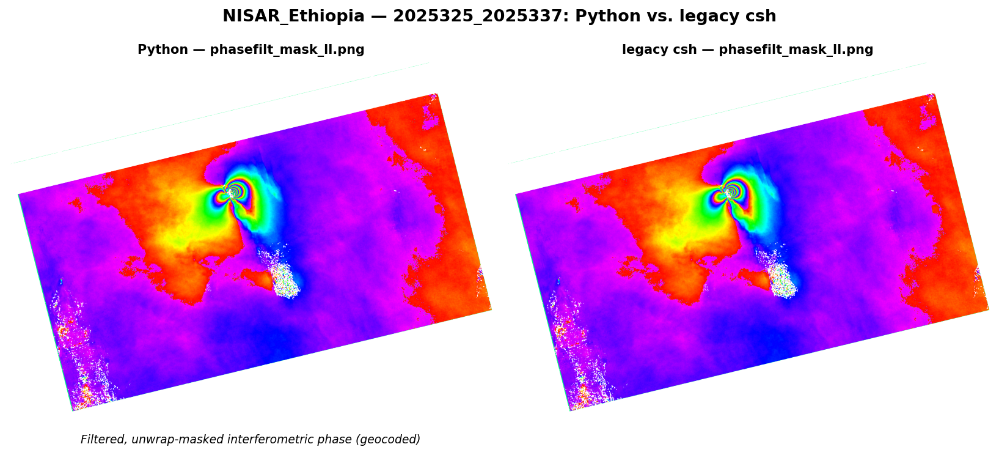

# GMTSAR Python framework

Python implementations of GMTSAR's heavy per-pixel **compute kernels** (cross-
correlation, phase difference, resampling, SAT geometry, biharmonic surface,
blockmedian, phase filter, plus selected grdmath/grdsample operators), wired
default-on at their primary call sites and verified bit-faithful to the csh/C
pipeline across a 21-case satellite matrix (20/21 clean; the one diff is the
documented Ridgecrest no-DEM corner).

**This is a hybrid, not a pure-Python or GMT-free pipeline.** A working **GMT
(≥6.4) install is required** — at runtime (~60 `gmt` subcommands for grid I/O,
projection, and visualization are never ported; most invocations of even the
*ported* operators still call `gmt`) and at build time (gmtsar's C binaries
link `libgmt`). The C/Fortran SAR preprocessors and snaphu (phase unwrapping)
also remain C. See `docs/release_notes/release_notes_v2.4.0.md` → *Scope & dependencies*, and `docs/PATHWAY_FORWARD.md` for the current, up-to-date porting status.

## Performance (v2.7.0, full 21-case sweeps, 2026-07-13)

Real, single-threaded, same-host measurements from the sweep tooling under `tests/` (`sweep.py` / `case_runner.py`), not an isolated microbenchmark (see `docs/PATHWAY_FORWARD.md` and `project_rules.md` Rule 12c for why that distinction matters). Two independent A/B comparisons:

### 1. Python vs. legacy csh

**20/21 cases clean** (the 1 exception is the documented `S1_Ridgecrest_EQ` no-DEM corner — not a regression).

| Case | csh | py | Speedup |
|---|---:|---:|---:|
| `NISAR_Ethiopia` | 543s | 178s | **3.05×** |
| `RS2_SLC_Hawaii` | 195s | 96s | **2.03×** |
| `CSK_RAW_Hawaii` | 822s | 601s | 1.37× |
| `ALOS_SLC_L1.1` | 448s | 337s | 1.33× |
| `TSX_SLC_Hawaii` | 852s | 647s | 1.32× |
| `S1_Ridgecrest_EQ`* | 9385s | 8139s | 1.15× |
| `ALOS2_SCAN_SSAF` | 9016s | 7828s | 1.15× |
| ... 14 more cases ... | | | 0.91×–1.14× |

Aggregate (wall-time weighted across all 21 cases): **1.08×**. * `S1_Ridgecrest_EQ`'s 5 file failures are the documented no-DEM-corner exception (phasefilt complex-rms ~0.35, on record since 2026-06-14).

### 2. `topo_interp_mode=0` (gmt surface) vs. `=1` (triangulation fast-path)

Both sides Python — an internal algorithm A/B, not a py-vs-csh check. Run via `sweep.py --topo-mode-ab`. **16/21 cases fully clean** (167/181 file comparisons pass); the 5 failing cases (`ENVI_Baja_EQ`, `ENVI_Baja_EQ_SLC`, `ALOS_Baja_EQ`, `CSK_SLC_Italy`, `ALOS_haiti`) are a real, independently-reproduced confirmation of a known algorithm-accuracy tradeoff — the exact same 5 cases (with closely matching magnitudes) were first flagged in `docs/reports/mode_interp_sweep_results_2026-07-09.md`.

| Case | mode0 | mode1 | Speedup |
|---|---:|---:|---:|
| `ALOS2_Brazil` | 886s | 257s | **3.45×** |
| `ENVI_Baja_EQ_SLC` | 1455s | 446s | 3.26× |
| `S1A_SLC_TOPS_COVE` | 6128s | 1932s | 3.17× |
| `ALOS4_Pinon` | 1215s | 401s | 3.03× |
| `S1A_SLC_TOPS_Greece` | 3082s | 1028s | 3.00× |
| ... 16 more cases ... | | | 1.09×–2.93× |

Aggregate (wall-time weighted across all 21 cases): **2.15×**. Multi-subswath Frame cases (S1 TOPS, ALOS2_SCAN) see the largest speedups since topo-simulation cost is a bigger fraction of their total wall time. Full tables, magnitudes, and known-tradeoff detail: `docs/release_notes/release_notes_v2.7.0.md`.

Example comparison (`NISAR_Ethiopia`, the fastest py-vs-csh case): Python output (left) vs. legacy csh (right), same interferogram, pixel-for-pixel — generated by `tools/py_vs_csh_figure.py` from real sweep output, not a mockup.



## Installation

One consolidated installer: `gmtsar/python/install.sh`. It builds gmtsar **in-place** from this checkout (no system-wide install, no re-clone). Each step is an independent flag — combine as needed:

| Flag | What it does |
|---|---|
| `--ubuntu` | apt-install system deps (csh, gmt, gfortran, …) — **requires sudo** |
| `--conda`  | use an existing conda env for build deps + Python packages — **no sudo**. Default env name `gmtsar` (override with `CONDA_GMTSAR_ENV=<name>`). Mutually exclusive with `--ubuntu`. |
| `--python` | install Python packages (skimage, xarray, netcdf4, tk, …) into apt or the conda env, depending on mode |
| `--build`  | autoconf + configure + make + make install (lands in `<repo>/bin`); also builds the FFTW shim and symlinks Python utils + csh scripts into `<repo>/bin` |
| `--orbits` | fetch `ORBITS.tar` (~5-7 GB) into `<repo>/orbits` |
| `--all`    | shortcut for `--ubuntu --python --build` (omits the large orbits download) |

Typical first runs:
```
# Ubuntu / sudo path:
bash gmtsar/python/install.sh --all

# Shared-server / no-sudo path:
bash gmtsar/python/install.sh --conda --python --build
```

Then export the env vars printed at the end:
```
export GMTSAR=<this repo>
export PATH=$GMTSAR/bin:$PATH
```

**`--conda` mode:** also put the conda env on PATH so `gmt` (and other
build-env tools) are found — the line above only adds `$GMTSAR/bin`:
```
conda activate gmtsar            # or: export PATH=$CONDA_PREFIX/bin:$PATH
```
(In `--ubuntu` mode `gmt` is installed system-wide and already on PATH, so
this step is not needed.)

Sanity check:
```
p2p_processing       # prints the usage/help message
gmt --version        # confirms gmt is reachable (needed for actual runs)
```

# Testing for developers

The test runner writes everything under a single work directory, resolved in this order:

1. `$SCRATCH/py.test/` — used if the `SCRATCH` environment variable is set
2. `gmtsar/python/work/` — default (inside this Python folder; gitignored)

Layout under the work directory:

```
<workdir>/
├── dataset/<caseName>.tar.gz    # downloaded raw tarballs (topex sample archive)
├── recipes/                     # per-case Python run scripts (README_<caseName>.txt)
├── results/<caseName>.json      # machine-readable comparison results (compare.py)
├── python_test/<caseName>/...   # Python framework run outputs
└── csh_test/<caseName>/...      # legacy csh reference results
```

For each case, `tests/sweep.py` (dispatching `tests/case_runner.py` per case):
1. Downloads `<caseName>.tar.gz` from `topex.ucsd.edu/gmtsar/tar/` into `dataset/` (if not cached).
2. Extracts the tarball **into both trees** — `csh_test/<caseName>/` and `python_test/<caseName>/` — so each tree is a fully self-contained dataset.
3. In `csh_test/<caseName>/`: runs the **bundled `README.txt`** (legacy csh recipe shipped in the tarball) with `csh README.txt > log.txt 2>&1`. Skipped if `intf/` already has outputs (sentinel-guarded oracle cache).
4. In `python_test/<caseName>/`: copies `recipes/README_<caseName>.txt` (your Python recipe) and runs it with `bash README_<caseName>.txt > log.txt 2>&1`.
5. After all cases finish, `tests/compare.py` diffs the `.grd`/`.png` outputs and writes both human lines on stdout and per-case JSON to `<workdir>/results/<case>.json`.

Run sweep (full / fast / single case):
```
python3 gmtsar/python/tests/sweep.py                        # full sweep, all 21 cases (~3 h cached / ~8 h first run; Ridgecrest-bound)
python3 gmtsar/python/tests/sweep.py --fast                 # 12 cases (~27 min, bounded by ENVI_Baja_EQ)
python3 gmtsar/python/tests/sweep.py --fast --cases RS2_SLC_Hawaii   # single case (works with --full too)
```

Force a re-run of an already-passing (cached) case: `--force` (hard: wipe csh+python+results), `--force py` (soft: wipe only python_test+results, keep the csh oracle), `--force stage` (wipe only stage-cache sentinels).

Inside one sweep: each case runs in its own background subprocess (`subprocess.run(..., start_new_session=True)` inside `case_runner.py`, invoked by a bounded `threading.Semaphore` pool in `sweep.py`); within a case, csh and python recipes run in parallel threads. Cap concurrent cases with `--parallel N` (default 12). `compare.py` is invoked in-process via `runpy` after all cases finish.

`--topo-mode-ab` repurposes the same tree-pair machinery for a `topo_interp_mode=0` vs `=1` A/B comparison (both sides run the Python recipe, no csh) — folders are named `ref_test`/`new_test` in that mode instead of `csh_test`/`python_test`.

(The previous bash implementation — `sweep.sh`, `case_runner.sh`, `runner.py` — is archived at `tests/archive/`; see `tests/archive/README.md` for why it was rewritten.)

## Sample datasets

Test inputs come from the GMTSAR sample archive:
```
http://topex.ucsd.edu/gmtsar/tar/{caseName}.{ext}
```
The full case manifest (satellite, archive extension, tier membership, enabled flag) is defined in `gmtsar/python/tests/cases.py` (`CASES` dict). One case uses `.tgz` instead of `.tar.gz`: `NISAR_SIM_ALOS` (and is `enabled: False` because topex returns HTTP 403 for that archive).

## csh reference results

`tests/compare.py` compares Python-framework outputs against reference results produced by the legacy csh framework. The reference tree lives at `<workdir>/csh_test/<caseName>/...`; intf-subdir paths are auto-discovered from the filesystem (no longer hardcoded). Files compared: `corr_ll.png`, `display_amp_ll.png`, `phasefilt_mask_ll.png`, `corr_ll.grd`, `phasefilt.grd`, `filtcorr.grd`.

If `csh_test/<caseName>/intf/` has no `.grd`/`.png` outputs, `case_runner.py` automatically runs the bundled `README.txt` (csh recipe) to generate the reference.

A frozen-csh reference can be optionally produced via `tests/freeze_reference.py`, which snapshots current csh outputs into `tests/reference/<caseName>/...`. When present, `compare.py` runs three pairs per file (python-vs-csh, csh-vs-frozen, python-vs-frozen). The reference dir is gitignored (~5.8 GB if produced).

## Notes on the framework
1. Per-case computing time is collected in `<workdir>/timeSpentLog.txt`; stdout from each case is piped to `log.txt` in the case folder. A summary (wall-clock + per-pipeline timings) prints at the end of `sweep.py`.
2. `tests/compare.py` does the comparison. Required Python packages are installed by `install.sh --python`. Per-file thresholds live in `PNG_SSIM_THRESHOLD` / `GRD_RMS_THRESHOLD` dicts at the top of the script (phase-named outputs use a complex-domain rms metric that's invariant to 2π wraps).
3. `tests/report.py` aggregates `results/*.json` and emits `<workdir>/sweep_summary.md`.
4. The case manifest, tier membership, and `enabled` flags live in `tests/cases.py` (`CASES` dict).

Version history: see [`docs/release_notes/`](docs/release_notes/) for all release notes (one file per version).

## Acknowledgments

Portions of the 2026-05 testing-system overhaul, consolidated installer (`install.sh`), Docker dev environment (`docker/`), FFTW threading shim (`fftw_force_serial.c`), and vectorized Python xcorr (`xcorr_py`) were developed in collaboration with Anthropic's Claude Code (Claude Opus 4.7).
